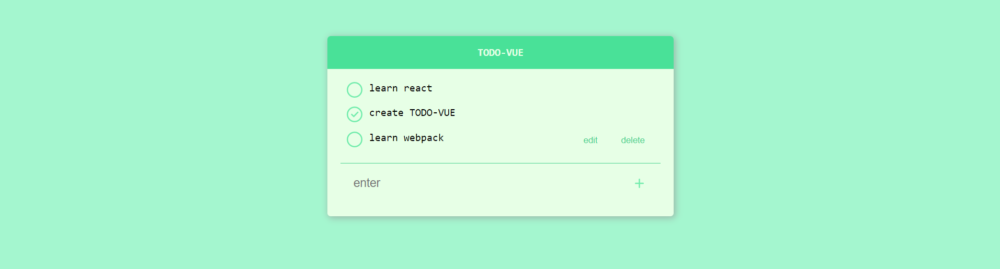

# 

## Getting started
To get the frontend running locally:
- Clone this repo
- `npm/yarn install` to install all req'd dependencies
- `npm/yarn serve` to start the local server (this project uses create-react-app)